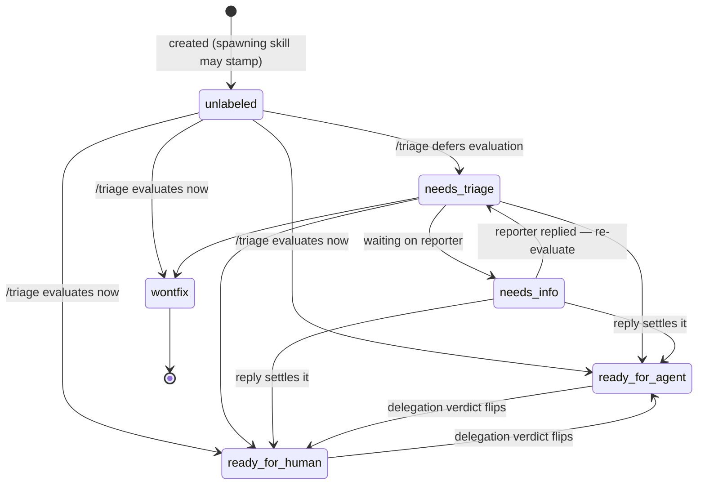
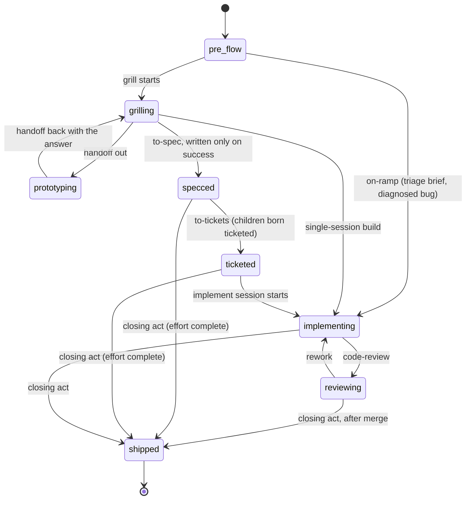

# The state machines finalize as display contracts; next action reads one computed priority table; misattribution shows with a caveat

Status: accepted

Ticket #52 asked for the exact states, legal transitions, and writers of the two machines ADR 0007 split apart, the derived next-recommended-action ordering, and the posture for wrong attribution. The decision: both machines are display contracts, not enforcers — every view derives from phase + triage state + deferred + open/closed + assignee + computed-blocked, and nothing else is stored. **Triage state** is set at creation by the skill that spawns the work item (to-tickets children are born `ready-for-agent`; decision tickets are born unlabeled and never enter the machine — they exit by Resolution, not a triage verdict) and afterwards moved only by the triage skill; `needs-triage` means *evaluation pending*, not a mandatory waypoint — the triage skill may evaluate-and-stamp `unlabeled → ready-for-agent / ready-for-human / wontfix` in one act; `needs-info` re-enters `needs-triage` or escapes directly to `ready-for-agent / ready-for-human` when the reporter's reply settles classification; `ready-for-agent ↔ ready-for-human` flips with the delegation verdict; `wontfix` is terminal (reopening = a new issue); closed is the tracker's own flag, not a state. **Workflow phase** moves by the acting skill: `to-spec` writes `specced` only on success (a bounced spec never left grilling, so there is no `specced → grilling` edge); `to-tickets` births every child `workflow:ticketed` + `ready-for-agent` — creation is a flow skill touching the work, and decision tickets stay the only phase-free children; implement re-stamps `implementing` on rework (`reviewing → implementing`); `shipped` is terminal and written by the **closing act** of any completed work item — implement's closing checklist after merge for tickets; whoever closes a completed effort (map, spec parent) for efforts — legalizing `{specced, ticketed, implementing, reviewing} → shipped` at completion. **The frontier stays ADR 0008's structural selector**, untouched by readiness; the next-recommended-action function layers bucket filters on top and reads one ordered table: (1) in-flight assigned work — reviewing, then implementing, then claimed-but-not-started (resume-before-grab; informational only until session spawning lands, since sessions are observed, not acted on); (2) the implementation frontier — structural frontier ∧ `workflow:ticketed` ∧ `ready-for-agent` — action `/implement`; (3) the map frontier — grabbable decision tickets, worked per kind in map order ("first in map order wins"); (4) flow-advance — `/to-tickets` on efforts sitting at `specced`; (5) triage intake — `unlabeled ∪ needs-triage`, map children excluded — action `/triage`. Rationale: finish before start (WIP and context switches compound); merged work beats discovered work; planning advance precedes intake because triage gates work *entering*, not work finishing. Excluded from recommendation, surfaced instead: `needs-info` (waiting on a human), `ready-for-human` (the human's move), `deferred`, `wontfix`, `shipped`; there is no `/to-spec` row because grilling-completion is not machine-detectable. Tiebreaks: map order where it exists, issue number ascending in every bucket without a natural order; the global recommendation is the head of the first non-empty bucket. **Wrong attribution renders show-with-caveat — never hidden, never written back**: two phase labels resolve furthest-along with a warning (ADR 0007); a phase label on a decision ticket renders with a caveat and is ignored for flow math; impossible combinations (`implementing`+`needs-info`, `shipped`+open, `grilling`+`wontfix`, closed-without-`shipped`) render both facts with a caveat line in the blocker-graph prototype's "why not grabbable" grammar; sync warns and never fails, and nothing relabels.

Triage state (runs over open issues; closed is the tracker's flag, not a state):

Workflow phase (exactly one `workflow:` label; absent = pre-flow):

## Considered options

- **`needs-triage` as a mandatory waypoint** — rejected: contradicts tracker reality (27 ready-for-agent vs 1 needs-triage); `needs-triage` means evaluation pending, not a fixed stop every issue must visit.
- **`needs-info` round-trips through `needs-triage` only** — rejected: the reply usually settles classification; ceremony the data doesn't follow.
- **A `specced → grilling` back-edge for specs that reveal decision gaps** — rejected: `to-spec` writes `specced` only on success, so a bounced spec never left grilling; no rewrite machinery needed.
- **Efforts never wear `shipped` (closed + last phase forever)** — rejected: forks closed-effort into a quasi-state; ADR 0007's migration already treats closed≈shipped; the closing act is a real writer making a real move.
- **Implement's closing checklist stamps the parent effort when the last child ships** — rejected: an implicit write-back to a work item the session isn't working — the same posture that forbids sync relabels.
- **Hide or auto-correct wrong attribution at sync** — rejected: hides state from a control surface that exists to render it; relabels are unconsented mutations. Show-with-caveat extends ADR 0007's two-label precedent and ADR 0008's fail-closed-with-warning posture.
- **Extend the frontier predicate with readiness** — rejected: ADR 0008's frontier stays structural; readiness filters belong to the recommendation layer, or `needs-triage` work would masquerade as grabbable.
- **Closed/done as a triage state** — rejected: a third dimension recreates the `TicketStatus` conflation ADR 0007 retired; tracker open/closed is already a flag.
- **`unlabeled` excluded from triage intake** — rejected: intake exists to make unlooked-at work visible; excluding `unlabeled` hides exactly that.

## Consequences

- ADR 0010 is the display contract the implementation spec collapses around (#53's IA adopts it): views derive from phase + triage + deferred + open/closed + assignee + computed-blocked — no new stored state.
- The recommendation engine is a pure function over the snapshot; its in-flight row is informational until session spawning lands (ADR 0005's declared destination).
- `docs/agents/workflow-labels.md` gains the writer additions (creation-time stamping, success-gated `specced`, closing-act `shipped`); `docs/agents/triage-labels.md` points at the machine.
- The map's fog narrows: queue prioritization is resolved here; recommendation copy and rendering hang on #53.
- Edges are permissive enough to match tracker reality (evaluate-and-stamp, closing-act shipped), so skills never fight the machine to do the right thing; the machines constrain display, never skill writes.
