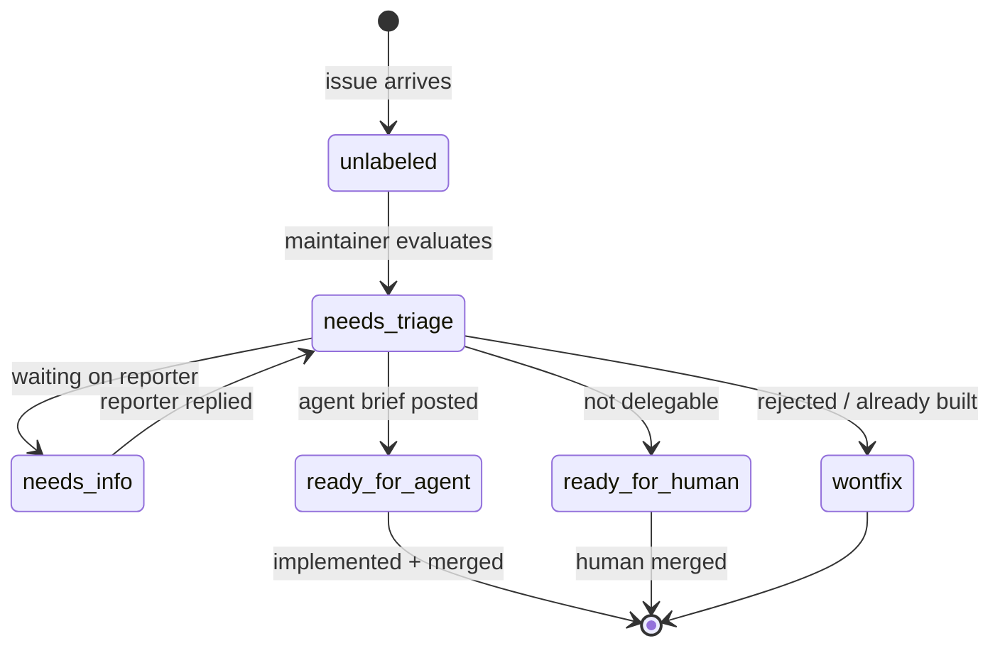
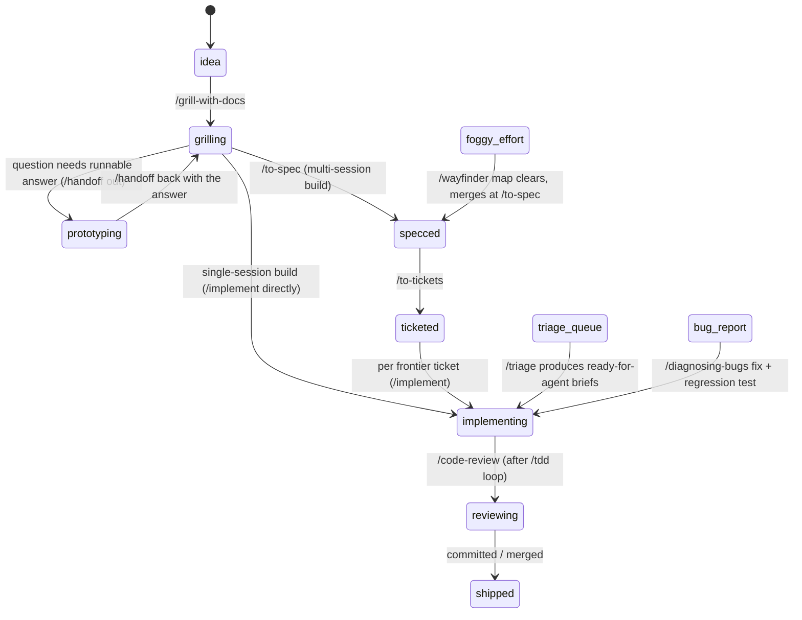

# Skills-ecosystem dashboard — wayfinding chart

Supporting asset for the wayfinder map **Skills-ecosystem dashboard** on
`Quick-Release/workbench`. It holds the audit, domain model, state machines,
journeys, gaps, and risks that the map indexes; the map's decision tickets hold
the decisions. Written before any ticket resolved; resolutions supersede it.

## 1. Audit: current architecture and supported workflow

**Stack.** TanStack Router + Vite (vite-plus), React 19, vendored shadcn/radix
primitives on Tailwind 4 tokens, Effect v4 RC Schema as the fail-loud data
boundary (`src/schema.ts`), vitest with `renderToString` smoke tests as the
test seam (ADR 0002), pnpm. Distributed as npm package `@quick-release/workbench`;
one install serves one host repo.

**Data path.** `pnpm sync` (`scripts/sync-data.mjs`) runs in Node and generates
`src/data.generated.ts`; the browser renders that snapshot and makes zero
network calls. Sources scraped today:

- `docs/plans/**/tickets/*.md` — plan tickets (status parsed from a `Status:`
  line, normalized by string heuristics; progress from checkbox counts).
- `docs/plans/*/{README,plan,roadmap}.md` — plan records.
- `docs/dashboard-plan/status.md` — canonical `BQ-nn` status ledger.
- `openspec/changes/*/{proposal,tasks}.md` — OpenSpec spec changes.
- Read-only service adapters (`scripts/services/`): GitHub, GitLab, Asana,
  Notion — open issues/tasks, status derived from labels via the triage
  vocabulary. In standalone mode workbench reads its own tracker
  (`Quick-Release/workbench`) by default.
- Optional ZCode session database (`scripts/sessions.mjs`): per-day/per-model
  aggregates plus a per-session rollup (id, taskType, **parent**, title,
  directory, started, requests, tokens, edits/writes). Prompt content is never
  read.

**Telemetry.** ADR 0001: identified, mandatory, sync-time reporting to a
Cloudflare Worker + D1 ingest; content crosses the boundary only by explicit
Developer Submission. The browser stays network-free.

**UI today.** App shell (sidebar persisted per repo) with four pages:
Overview (ticket ledger, plan corpus, OpenSpec panel, and the in-flight
**workflow views**: All work / Ready for grilling / Ready for spec / Ready for
tickets / Ready for implementation — a first, kind-and-status-based mapping of
the Ask Matt flow onto existing records), Sessions (usage charts), Skills
(hardcoded favorites shelf + Matt Pocock source install button), Tools
(Fallow/Renovate setup cards).

**Skills data today.** `scripts/skills-api.mjs` keeps a hardcoded list of 37
Matt Pocock skill ids, detects installed ones from `skills-lock.json` and
well-known skill directories, and serves `GET /api/skills` plus a
`POST /api/skills/matt-pocock/setup` install endpoint through a Vite
middleware plugin — the repo's only live localhost API seam so far. No
SKILL.md parsing, no categories beyond 12 hardcoded favorites, no flow
relationships.

**Workflow state today.** One flat `TicketStatus` vocabulary of eight values
mapped onto the five triage labels; a regex lifts triage labels out of
prose. `dependencies` is a display string, not structured edges — there is no
frontier computation, blocker graph, or phase model. GitHub issues carry no
sub-issue, dependency, comment, or closed-state information in the snapshot.

**Process context.** The repo dogfoods the full Ask Matt ecosystem: skills
installed under `.agents/skills/` + `.zcode/skills/`, tracker conventions in
`docs/agents/issue-tracker.md` (native sub-issues + native blocked-by
dependencies + frontier query), triage label vocabulary in
`docs/agents/triage-labels.md`, domain docs convention in
`docs/agents/domain.md` (CONTEXT.md + docs/adr/, used lazily).

## 2. Domain model

Vocabulary added to `CONTEXT.md` (Workflow section): **skill flow, main flow,
on-ramp, workflow phase, triage state, blocker edge, frontier, map, decision
ticket**. The model below uses those terms.

Entities (proposed snapshot records; every entity carries source path/URL for
traceability):

- **Skill** — `{id, name, category: engineering|productivity, flowRole:
main-flow-step | on-ramp | standalone | vocabulary-layer | primitive,
description, inputs, outputs, sourcePath, repoUrl, installed}`. Source:
  installed SKILL.md frontmatter + directory, classified by the Ask Matt map.
- **SkillFlowEdge** — `{from, to, kind: merges-onto | delegates-to |
pairs-with | runs-internally | hands-off-to | next-step}`. Source: the Ask
  Matt map (`ask-matt/SKILL.md`). Examples: grill-with-docs →prototype
  (hands-off-to, both directions via handoff); triage/wayfinder/
  improve-codebase-architecture → grilling (runs-internally); grill-me +
  grill-with-docs → grilling (delegates-to); grill-with-docs pairs-with
  domain-modeling; tdd + improve-codebase-architecture pull in
  codebase-design; wayfinder merges-onto main flow at to-spec.
- **WorkItem** — one polymorphic record family unifying what `TicketRecord`,
  `PlanRecord`, `SpecChangeRecord`, and GitHub issues represent: `{id, title,
triageState, category: bug | enhancement | none, workflowPhase, kind:
issue | plan-ticket | ledger-row | openspec-change, progress, assignee,
isExternal, source}`.
- **BlockerEdge** — `{blockedId, blockerId, source: github-native |
markdown-blocked-by | ledger}`. Enables the frontier computation everywhere.
- **Decision** — `{id, title, status: proposed | accepted | superseded, date,
origin: adr | map-ticket-resolution | spec-implementation-decision,
contextPointers[]}`. Sources: `docs/adr/*`, closed wayfinder tickets'
  resolution comments, spec implementation-decision sections.
- **Artifact** — `{id, kind: spec | ticket | research-note | prototype-branch
| handoff-doc | architecture-report | questionnaire | wizard-script,
path/url, producedBy: skillId, linksTo: WorkItem | Decision}`.
- **Session** — `{id, parent, taskType, title, directory, started, usage,
phase?, skillsInvoked?}` (fields after `usage` pending research).
- **ContextHandoff** — `{fromSession, toSession, mechanism: continue | clear |
compact | handoff-doc | background-handoff | subagent, atPhaseBoundary}` —
  derived from session trees + handoff conventions; mostly fog until research
  lands.
- **Map** (wayfinder) — `{id, destination, notes, decisionsSoFar[],
notYetSpecified[], outOfScope[], tickets: MapTicket[]}`; **MapTicket** —
  `{id, type: research | prototype | grilling | task, state, claimedBy,
blockers[], resolution}`.
- **Service** — existing `ExternalServiceStatus` (connected/skipped/error).

Key relationships: WorkItem 1..n BlockerEdge; Skill n..n SkillFlowEdge;
WorkItem n..1 workflowPhase; Decision n..n WorkItem/Artifact; Session tree via
parent; Map 1..n MapTicket (sub-issues).

## 3. Proposed state machines

Two orthogonal machines — conflating them is the main modeling risk:

**Triage state** (per tracker issue, moved by /triage):

**Workflow phase** (per work item or effort, moved by running skills — the
Ask Matt main flow, with on-ramp entry points):

**Frontier** is computed, never stored: `open ∧ unassigned ∧ all blockers
closed`. The "next recommended action" is a pure function over the machines:
nonempty triage buckets → run /triage; specced with no tickets → /to-tickets;
open frontier tickets → /implement the first; blocked everything → surface
blockers; open map frontier → work a decision ticket; implementation session
in flight → show it.

## 4. Dashboard user journeys and views

1. **Skill-flow graph** — the ecosystem at a glance: main-flow spine,
   on-ramps merging in, standalone shelf, vocabulary layers underneath;
   installed status per skill; click for inputs/outputs/when-to-use; entry
   from "what skill fits my situation" (the /ask-matt journey).
2. **Triage queue** — the three /triage buckets (unlabeled, needs-triage,
   needs-info with reporter activity), oldest first, with category and
   one-line summaries; drill into an issue's labels, brief, triage notes.
3. **Blocker/dependency graph** — tickets as a DAG, frontier highlighted as
   grabbable-now, blocked chains and the critical path visible; expand–contract
   refactors legible as expand/migrate/contract clusters.
4. **Current work and next recommended action** — in-flight sessions joined to
   tickets and phases, plus the derived recommendation (which skill to run
   next, on which record), freshness-labeled.
5. **Session/context handoffs** — session trees (parent/child), phase
   boundaries marked with the five boundary options (continue/clear/handoff/
   subagent/compact), token burn against the smart zone.
6. **Artifacts, decisions, ADR history** — timeline of specs, research notes,
   prototype branches, handoffs, questionnaires; ADR list with status and
   supersession; wayfinder maps with decisions-so-far and fog.
7. **Implementation and review status** — per-ticket progress (checkbox
   counts), branch/PR state, two-axis review outcomes (Standards vs Spec)
   surfaced where recorded.

## 5. Architecture gaps, integration requirements, seams

- **Structured edges**: `dependencies: string` → `BlockerEdge[]`. Sync must
  read GitHub native blocked-by + sub-issues (REST endpoints already
  documented in `docs/agents/issue-tracker.md`) and parse `Blocked by:` from
  local ticket files and the ledger.
- **Tracker coverage**: the GitHub adapter needs closed issues (state_reason),
  category labels (bug/enhancement), sub-issue tree, dependencies, comments
  (triage notes, agent briefs, wayfinder resolutions), and assignee — a
  richer "tracker adapter" distinct from the generic issue-list service.
- **Skills collector**: parse installed SKILL.md frontmatter + the Ask Matt
  map into Skill/SkillFlowEdge records (source of truth decision pending).
- **Decisions collector**: read `docs/adr/*` (status, supersedes) and closed
  map tickets' resolutions into Decision records.
- **Live seam**: snapshot-per-sync is stale for "current work"; the Vite
  middleware plugin (`skills-api.mjs`) is the precedent for localhost live
  endpoints. Decision pending on which views need live data.
- **Graph layer**: no rendering library in the tree; must work with the
  `renderToString` test seam (ADR 0002) and dark-only shadcn tokens. Behind a
  `GraphView` seam so the library stays swappable.
- **Schema**: every new record family gets Effect Schema coverage with the
  excess-property rejection matrix (repo convention), plus `renderToString`
  smoke tests per new view.
- **Phase attribution**: needs a tracker encoding (labels vs title prefixes
  vs sub-issue structure) — currently only the `Spec:` title prefix exists.

## 6. Risks, unresolved product decisions, alternatives

- **Heuristic sprawl**: `normalizeStatus`-style string matching multiplies per
  source and drifts; the fix is explicit encodings (labels/frontmatter) —
  decided on the phase-encoding ticket.
- **Two spec vocabularies** (OpenSpec changes vs GitHub `Spec:` issues) and
  three ticket sources (plan tickets, ledger rows, issues) risk a schizophrenic
  model; unification is a product decision, not a parsing detail.
- **GitHub API surface**: dependencies/sub-issues need REST/GraphQL calls per
  issue; rate limits and token scopes grow; closed-issue history can be large.
- **Read-only temptation**: "end-to-end workflow" could drift into the
  dashboard taking actions (moving labels, creating issues), contradicting the
  README's read-only browser posture and ADR 0001's network stance; explicitly
  a ticket, default no.
- **Graph complexity** vs the vendored-shadcn, no-runtime-dependency aesthetic;
  alternative is hand-rolled SVG for the ≤~40-node scale of a host repo.
- **Session attribution uncertainty**: the session DB may not record skill
  invocations or /clear//compact events; handoff docs live in the OS temp dir
  and may be unreachable; the handoffs view may have to ship partial.
- **Catalog drift**: the hardcoded 37-id list goes stale vs upstream
  mattpocock/skills; alternatives are lockfile-only, local-parse, or
  upstream-fetch at sync time.
- **Scope gravity**: "complete visual dashboard" invites boiling the ocean;
  the map's destination is decision-completeness, and build slices stay on the
  main flow afterwards.

## 7. Decision tickets (dependency order)

Frontier (takeable now): the two research tickets, then the unblocked
grilling decisions. Downstream: prototypes after their inputs are decided,
the state machine after its inputs, IA last.

| Order | Ticket                                                 | Type      | Blocked by                                                                    |
| ----- | ------------------------------------------------------ | --------- | ----------------------------------------------------------------------------- |
| 1     | What the session database can attribute                | research  | —                                                                             |
| 2     | Graph rendering approach for flow and blocker graphs   | research  | —                                                                             |
| 3     | Confirm the read-only boundary for new views           | grilling  | —                                                                             |
| 4     | Sources of truth for the skills catalog and flow edges | grilling  | —                                                                             |
| 5     | How the tracker encodes phase and kind                 | grilling  | —                                                                             |
| 6     | Structured blocker edges and the frontier              | grilling  | —                                                                             |
| 7     | Live seam: snapshot refresh vs dev-server API          | grilling  | —                                                                             |
| 8     | Decision and artifact modeling                         | grilling  | —                                                                             |
| 9     | Prototype: the skill-flow graph                        | prototype | rendering approach; catalog sources                                           |
| 10    | Prototype: blocker graph and frontier                  | prototype | rendering approach; blocker edges                                             |
| 11    | The workflow state machine and next-action rules       | grilling  | session research; phase encoding; blocker edges; live seam; decision modeling |
| 12    | Information architecture for the new views             | grilling  | state machine; both prototypes                                                |

Fog (in the map's Not-yet-specified, not ticketed): multi-repo ecosystem scope
(hangs on catalog sources), skill-invocation attribution (hangs on session
research), consolidation of the three planning vocabularies (hangs on phase
encoding + decision modeling), recommendation copy and queue prioritization
(hangs on the state machine).

Out of scope: implementing the dashboard itself (main-flow work after this
map), changing the ADR 0001 telemetry contract, hosted/multi-tenant
deployment.
